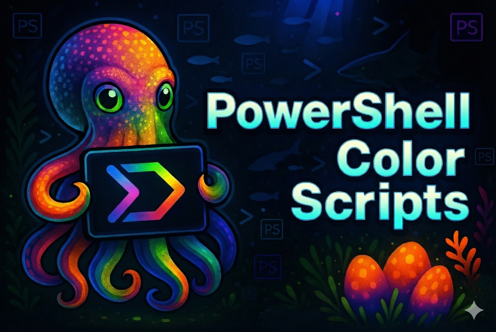

# ColorScripts-Enhanced PowerShell Module

> **Credits:** This project owes its existence to the foundational work of two developers. The beautiful ANSI art scripts were originally created and/or sourced by Derek Taylor (DistroTube) in his project [shell-color-scripts](https://gitlab.com/dwt1/shell-color-scripts). The collection was then ported to PowerShell by Scott McKendry as [ps-color-scripts](https://github.com/scottmckendry/ps-color-scripts). `ColorScripts-Enhanced` builds upon their efforts by introducing a high-performance caching system, PowerShell Cross-Platform support on Linux and Mac, an expanded command set, and a formal module structure.

<!-- Download & Version Badges -->

[](https://www.powershellgallery.com/packages/ColorScripts-Enhanced)
[](https://www.powershellgallery.com/packages/ColorScripts-Enhanced)
[](https://www.nuget.org/packages/ColorScripts-Enhanced/)
[](https://www.nuget.org/packages/ColorScripts-Enhanced/)
[](https://github.com/Nick2bad4u/ps-color-scripts-enhanced/releases/latest)

<!-- CI/CD & Quality Badges -->

[](https://github.com/Nick2bad4u/ps-color-scripts-enhanced/actions/workflows/test.yml)
[](https://codecov.io/gh/Nick2bad4u/PS-Color-Scripts-Enhanced)
[](https://github.com/Nick2bad4u/ps-color-scripts-enhanced/actions/workflows/publish.yml)
[](https://scorecard.dev/viewer/?uri=github.com/Nick2bad4u/PS-Color-Scripts-Enhanced)
[](https://github.com/Nick2bad4u/PS-Color-Scripts-Enhanced/actions/workflows/dependency-review.yml)
[](https://deepwiki.com/Nick2bad4u/PS-Color-Scripts-Enhanced)

<!-- Platform & Compatibility -->

[](https://github.com/Nick2bad4u/ps-color-scripts-enhanced)
[](https://github.com/PowerShell/PowerShell)
[](https://github.com/Nick2bad4u/ps-color-scripts-enhanced)
[](https://github.com/Nick2bad4u/ps-color-scripts-enhanced/stargazers)

<!-- License & Contributing -->

[](LICENSE)
[](CONTRIBUTING.md)

A high-performance PowerShell module for displaying beautiful ANSI colorscripts in your terminal with intelligent caching for 6-19x faster load times.

<p align="center">
  
</p>


## ✨ Features

- **<!-- COLOR_SCRIPT_COUNT_PLUS -->3156+<!-- /COLOR_SCRIPT_COUNT_PLUS --> Colorscripts** — Fractals, patterns, characters, nature scenes, and more
- **6-19x Faster** — Intelligent caching drops load times to 5-20ms
- **Cross-Platform** — Works on Windows, macOS, and Linux
- **10 Languages** — English, German, Spanish, French, Italian, Japanese, Dutch, Portuguese, Russian, Chinese
- **Easy to Use** — Simple commands with tab completion

## 🚀 Quick Start

```powershell
# Install from PowerShell Gallery
Install-Module -Name ColorScripts-Enhanced -Scope CurrentUser

# Import and display a random colorscript
Import-Module ColorScripts-Enhanced
Show-ColorScript

# Add to your profile (optional - shows colorscript on every terminal open)
Add-ColorScriptProfile
```

> Requires PowerShell 5.1+. PowerShell 7+ recommended for best performance.

## 📖 Basic Usage

```powershell
# Show a random colorscript
Show-ColorScript
scs                          # shorthand alias

# Show a specific colorscript
Show-ColorScript -Name "mandelbrot-zoom"
scs pikachu

# List all available colorscripts
Show-ColorScript -List
Get-ColorScriptList

# Filter by category
Get-ColorScriptList -Category Patterns
Get-ColorScriptList -Tag Recommended

# Include Pokémon scripts (opt-in)
Show-ColorScript -IncludePokemon
```

## ⚡ Boost Performance with Caching

```powershell
# Build cache for all scripts (recommended after install)
New-ColorScriptCache

# Rebuild cache if scripts seem stale
New-ColorScriptCache -Force

# Include Pokémon scripts when building the cache
New-ColorScriptCache -IncludePokemon

# Clear cache if needed
Clear-ColorScriptCache -All
```

## 🎨 Examples

**Add a colorscript to your terminal startup:**

```powershell
# Option 1: Use the built-in helper
Add-ColorScriptProfile

# Option 2: Manually edit your profile
notepad $PROFILE
# Add these lines:
Import-Module ColorScripts-Enhanced
Show-ColorScript

# Option 3: Always include Pokémon art
Add-ColorScriptProfile -IncludePokemon -SkipPokemonPrompt
```

**Create a custom alias:**

```powershell
Set-Alias -Name cs -Value Show-ColorScript
```

## 🔧 Commands Reference

| Command | Alias | Description |
|---------|-------|-------------|
| `Show-ColorScript` | `scs` | Display a colorscript (random or by name) |
| `Get-ColorScriptList` | — | List available colorscripts |
| `New-ColorScriptCache` | — | Build cache for faster performance |
| `Clear-ColorScriptCache` | — | Remove cached files |
| `Add-ColorScriptProfile` | — | Add module to your PowerShell profile |

**Get help for any command:**

```powershell
Get-Help Show-ColorScript -Examples
```

## 🔤 Nerd Font Support

Some colorscripts use special glyphs that require a [Nerd Font](https://www.nerdfonts.com/). If you see boxes instead of icons:

1. Download a Nerd Font (e.g., CascadiaCode, FiraCode, JetBrainsMono)
2. Install the font and set it as your terminal font
3. Test with: `Show-ColorScript -Name nerd-font-test`

## 🐛 Troubleshooting

**Colorscript not displaying correctly?**
```powershell
Show-ColorScript -Name "scriptname" -NoCache
```

**Cache seems stale?**
```powershell
New-ColorScriptCache -Force
```

**Module not found?**
```powershell
Get-Module ColorScripts-Enhanced -ListAvailable
```

## 📋 Requirements

- **PowerShell:** 5.1+ (7+ recommended)
- **OS:** Windows 10/11, macOS 10.13+, or Linux
- **Terminal:** Any ANSI-capable terminal (Windows Terminal, VS Code, iTerm2, etc.)

---

## 📚 More Information

<details>
<summary><b>📖 User Documentation</b></summary>

- [Quick Reference Guide](docs/QUICK_REFERENCE.md)
- [ANSI Color Guide](docs/ANSI-COLOR-GUIDE.md)
- [Module Summary](docs/MODULE_SUMMARY.md)
- [Changelog](CHANGELOG.md)

</details>

<details>
<summary><b>🛠️ Developer Documentation</b></summary>

- [Development Guide](docs/DEVELOPMENT.md)
- [Testing Guide](docs/TESTING.md)
- [Linting Guide](docs/LINTING.md)
- [npm Scripts Reference](docs/NPM_SCRIPTS.md)
- [Publishing Guide](docs/PUBLISHING.md)
- [Release Checklist](docs/RELEASE_CHECKLIST.md)
- [ANSI Conversion Guide](docs/ANSI-CONVERSION-GUIDE.md)

</details>

<details>
<summary><b>🤝 Contributing & Community</b></summary>

- [Contributing Guidelines](CONTRIBUTING.md)
- [Code of Conduct](CODE_OF_CONDUCT.md)
- [Security Policy](SECURITY.md)
- [Support Policy](docs/SUPPORT.md)
- [Project Roadmap](docs/ROADMAP.md)

</details>

<details>
<summary><b>🔄 CI/CD & Quality</b></summary>

[](https://github.com/Nick2bad4u/ps-color-scripts-enhanced/actions/workflows/test.yml)
[](https://codecov.io/gh/Nick2bad4u/PS-Color-Scripts-Enhanced)
[](https://scorecard.dev/viewer/?uri=github.com/Nick2bad4u/PS-Color-Scripts-Enhanced)

- [Test Workflow](.github/workflows/test.yml)
- [Publish Workflow](.github/workflows/publish.yml)

</details>

---

## 🙏 Credits

Built upon the work of:
- [Derek Taylor (DistroTube)](https://gitlab.com/dwt1/shell-color-scripts) — Original shell-color-scripts
- [Scott McKendry](https://github.com/scottmckendry/ps-color-scripts) — PowerShell port

ANSI art sourced from [16colo.rs](https://16colo.rs/), [ArtScene](http://artscene.textfiles.com/artpacks/), and [r/ANSIart](https://www.reddit.com/r/ANSIart/).

## 📄 License

[Unlicense](LICENSE) — Public domain. Do whatever you want with it.

---

**Enjoy the colors!** 🌈✨
